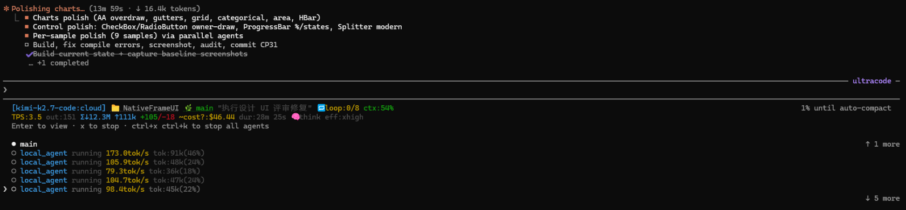

# cc-statusline

A custom status line for [Claude Code](https://claude.ai/code): model, output TPS, token/cost totals, git branch, context usage, prompt-cache health and rate limits — plus one row per subagent. Single-file Node.js scripts, zero dependencies (built-ins only), Node ≥ 16 or Bun.



## What it shows

Main session — two lines; every segment appears only when the data exists:

```
[Sonnet 5] 📁 my-project 🌿 main PR#123👀 🌳wt:my-wt ctx:42%/200k
TPS:38.2 out:1.2k cache:15k pc:87%(5m) Σ↓120k ↑8.4k +120/-15 ~cost:$0.31 dur:2m 14s 5h:24% (2h06m) 7d:81% sp:45% ⚡fast 🧠think eff:high
```

| Segment | Meaning |
|---|---|
| `[model]` `📁` `🌿` | Model, cwd (clickable `file://` link), branch (clickable link to its GitHub / GitLab / Bitbucket page) |
| `PR#123👀` / `MR#` | PR number + review state; GitLab merge requests render `MR#` |
| `🌳wt:` / `🤖` | Worktree name / agent name (`--agent` sessions) |
| `ctx:42%/200k` | Context usage against the actual window size (green → yellow → red) |
| `TPS:38.2` | Output tokens/sec of the last response; `(Xm ago)` once it's over 2 min stale |
| `out:` `cache:` | Last response's output / cache-read tokens |
| `pc:87%(5m)` | Prompt-cache hit ratio + TTL (`(cold)` while rebuilding) — every miss re-bills cache-write on the whole prefix |
| `Σ↓ ↑` | Session-wide input/output token totals |
| `+120/-15` | Lines added / removed |
| `~cost:` | Self-computed cost (see below); `~cost?:` marks the untrusted client-estimate fallback |
| `dur:` | Session duration |
| `5h:` `7d:` `sp:` | Rate-limit / spend-limit usage, with a compact time-to-reset |
| `⚡fast` `🧠think` `eff:` `VIM:` `style:` | Mode flags; the trailing `v2.x` is the Claude Code version |

Subagent rows — one line per task, real stats from the agent's own transcript when available (`TPS`), payload-derived fallback otherwise (`tok/s`):

```
local_agent  running  Verifying soak.sh binary configuration  67.5TPS  tok:198k(20%)  out:8.7k  1h7m  ~$1.23
Explore      running  166.7tok/s  tok:50k(25%)  5m00s  ~$0.01  eff:high
```

## Install

```bash
npm install -g @tangjianfang/claudecode-statusline
```

Done — the postinstall copies `statusline.js` to `~/.claude/`, registers it as both `statusLine` and `subagentStatusLine`, and seeds `~/.claude/pricing.json`. Restart Claude Code. Also published under the shorter name `@tangjianfang/cc-statusline`.

Other package managers and newer npm (all tested; the only difference is whether the wiring postinstall is allowed to run):

| Manager | Command | Wiring |
|---|---|---|
| npm ≤ 11 | `npm install -g @tangjianfang/claudecode-statusline` | automatic |
| npm 12+ | add `--allow-scripts=@tangjianfang/claudecode-statusline` to the install (or `npm config set allow-scripts=@tangjianfang/claudecode-statusline --location=user` once, for all global installs) — npm v12 blocks install scripts by default | after `--allow-scripts` |
| Yarn Classic (v1) | `yarn global add @tangjianfang/claudecode-statusline` | automatic |
| Bun | `bun add -g @tangjianfang/claudecode-statusline` then `bun pm -g trust @tangjianfang/claudecode-statusline` | after `trust` |
| pnpm (v10+) | `pnpm add -g @tangjianfang/claudecode-statusline` then `pnpm approve-builds -g` | after approval |
| Yarn Berry (v2+) | add as a project dependency, then run `cc-statusline --install` once | manual (Berry removed `global add`) |

Under Bun the registered interpreter is the real Bun binary, so Node doesn't need to be installed. Manual wiring works everywhere: `cc-statusline --install` (or `git clone` + `./install.sh`); check what's wired with `cc-statusline status`.

> **Upgrading from v1.x?** The `loopctl` auto-continue loop was removed — Claude Code has native `/goal` now. The postinstall deregisters its Stop hook and deletes the old files automatically.

## Cost estimation

Claude Code's `total_cost_usd` is priced at Anthropic's rates — wrong when you route to a third-party model via `ANTHROPIC_BASE_URL` (MiniMax, GLM, Kimi, …). So the script self-computes cost from the transcript's token counts × a plain, editable pricing table:

```
cost = freshInput/1M × in + output/1M × out + cacheRead/1M × cacheRead + cacheCreate/1M × cacheWrite
```

`pricing.json` ships with the repo and is seeded to `~/.claude/pricing.json` on install (never overwrites your copy). It covers the canonical chat models of Anthropic, OpenAI, Gemini, MiniMax, DeepSeek, Llama, Mistral, Grok, Cohere, Qwen, Z.ai/GLM and Moonshot/Kimi, keyed by model name — exact match first, then longest substring (`glm-5.3[1m]` matches `glm-5.3`). No match → falls back to the client estimate, shown as `~cost?:`.

Refresh rates on demand (deliberately no auto-update — rewriting rate data in the background is not this tool's job):

```bash
pricing-updater                                  # merge fresh rates into ~/.claude/pricing.json
pricing-updater --list minimax                   # inspect matching keys + rates, write nothing
pricing-updater --out pricing.json --overwrite   # maintainer: refresh the repo's shipped copy
```

## How it works

Claude Code pipes a JSON payload on stdin. Per-message token/timing data isn't in it, so the script re-parses the JSONL transcript at `transcript_path`, pairing each assistant message's `usage.output_tokens` with the preceding user-message timestamp to derive TPS, and accumulating session-wide totals (sidechain entries feed the Σ totals but not the main-line figures). Subagent stats come from `<project dir>/<session id>/subagents/agent-<task id>.jsonl`, parsed the same way. To see what your build actually sends: `touch ~/.claude/statusline-debug`, reproduce, then read `~/.claude/statusline-payloads.log`.

## Limitations

- **TPS describes the last response, not real-time decode** — the window includes network round-trips and time-to-first-token, and the line only re-runs when a new message completes. Add `"refreshInterval": 2` to the statusLine config for more frequent refresh.
- **`~cost:` is an estimate** — as accurate as your `pricing.json` rates.
- **Subagent stats depend on the agent transcript** — without it, rows fall back to the payload's sparsely-populated `tokenCount`/`tokenSamples`; absent fields are omitted rather than shown as zeros.
- **`pc:` / `5h:` / `7d:` / `sp:` need gateway data** — they appear only after the first API response, and may never appear on third-party `ANTHROPIC_BASE_URL` gateways.
- **Branch links cover GitHub / GitLab / Bitbucket** — self-hosted Git renders plain text.

## Releasing a new version (maintainer)

Pushes to `main` auto-publish via CI — but only when the version in `package.json` differs from npm, so docs-only pushes stay silent. Flow: `npm version patch` → update `CHANGELOG.md` → commit & push. CI publishes both package names, pushes the `vX.Y.Z` tag, and creates the GitHub Release.

CI authentication: the classic route is a granular npm token with publish scope on both packages stored as the `NPM_TOKEN` secret — note npm is deprecating 2FA-bypass tokens (they lose account/package management now and direct publish around Jan 2027, per npm's [security changelog](https://github.blog/changelog/2026-07-08-npm-install-time-security-and-gat-bypass2fa-deprecation/)), so plan to migrate the workflow to npm **trusted publishing** (OIDC, tokenless) before then.
