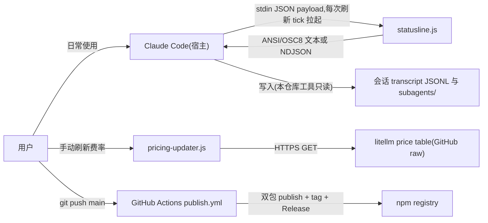
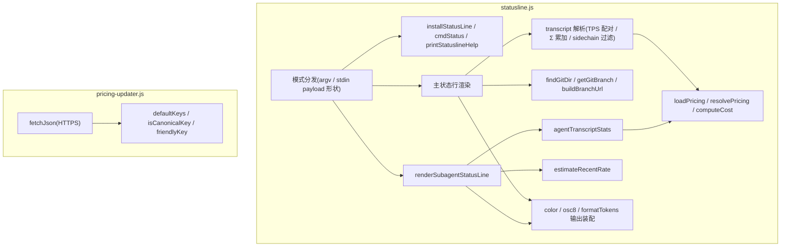
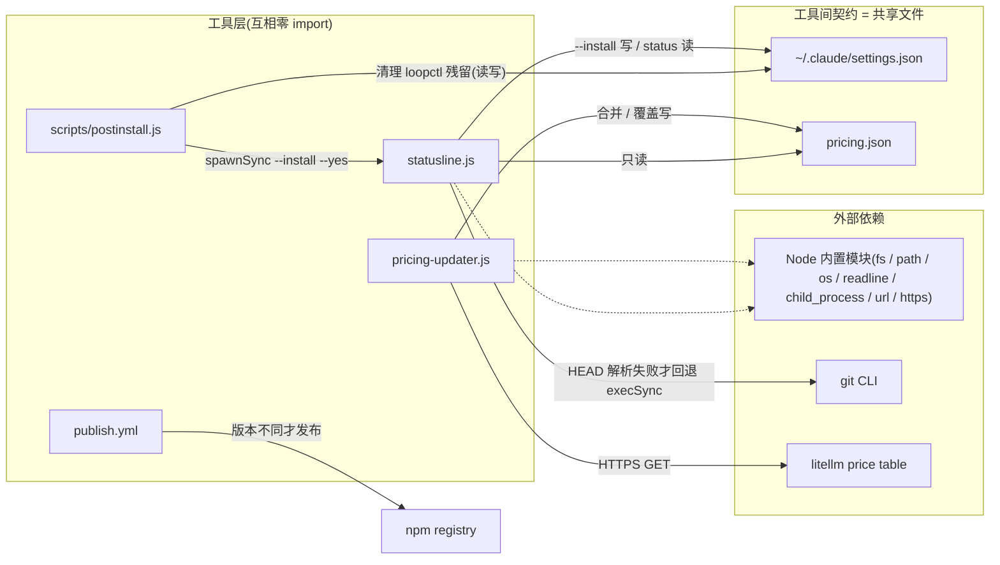
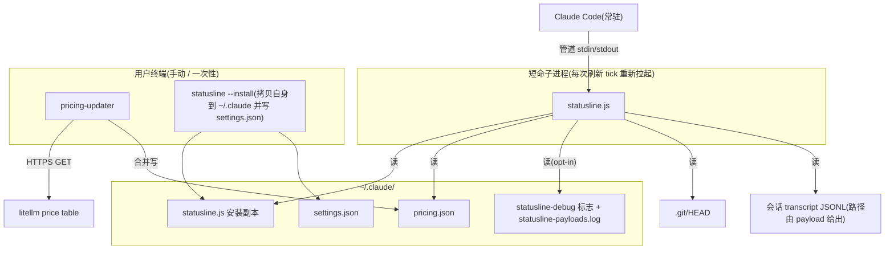
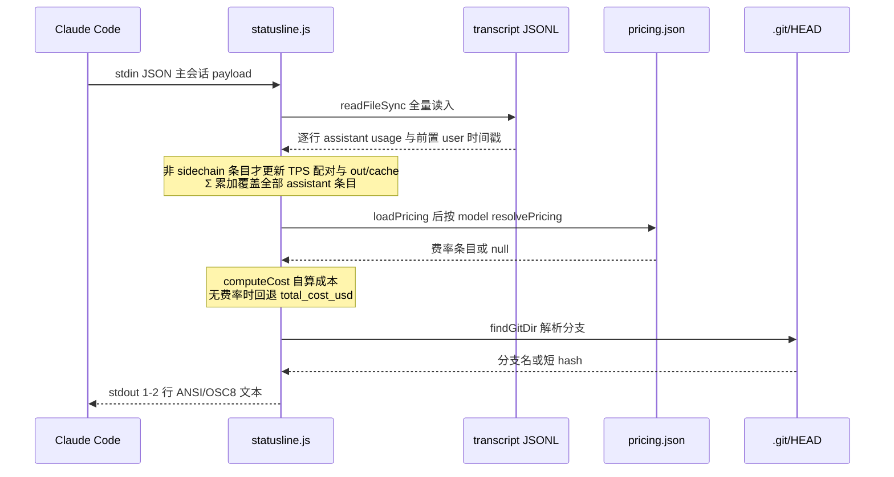

# CCStatusLine 架构文档

> 范围:v2.0.0(main,2026-09-30)。覆盖各工具的模块边界、进程间契约、关键数据流与既定决策。

## Overview

本仓库是服务于 Claude Code 的两个相互独立的单文件 Node.js CLI:`statusline.js`(主状态行 + subagent 行渲染)与 `pricing-updater.js`(手动刷新模型费率表),外加一个 npm postinstall 串联脚本和一个 CI 自动发布流。零第三方依赖、零构建步骤,全部只使用 Node 内置模块。v1.x 的 loopctl(Stop-hook 自动续跑循环)已于 2.0.0 移除——Claude Code 已原生支持 `/goal`。

## Architecture Context

系统与外部世界的边界:Claude Code 是宿主,本仓库的工具都是被它或用户拉起的短命子进程;唯一的出网点是 pricing-updater。

transcript 的写入方是 Claude Code,本仓库工具只读;statusline 在渲染路径上从不访问网络。

## Logical Architecture

两个工具之间零 import——刻意独立,唯一的工具间契约是共享文件(见 Dependency)。图内为各文件内部的真实函数分组。

| Component | 负责 | 不负责 |
|---|---|---|
| statusline.js | 主状态行与 subagent 行渲染;从 transcript 自算 TPS / Σ token / 成本;`--install` 安装与 `status` 自检;opt-in 调试捕获 | 不写 pricing.json;渲染路径不访问网络;不管理费率数据 |
| pricing-updater.js | 从 litellm 拉取、按 canonical 规则过滤去重、合并或覆盖写 pricing.json;无参数运行即默认合并 | 不被 statusline 调用;无定时任务;不参与渲染 |
| scripts/postinstall.js | npm 安装后以 `--yes` 串联 statusline 的 `--install`;best-effort 清理 v1.x loopctl 残留(Stop hook 注册、`~/.claude/loopctl.js`);失败仅告警不阻断 | 不自行复制文件或改配置(委托 statusline 自己);不做用户交互 |
| .github/workflows/publish.yml | 版本比对后发布双包、打 tag、建 GitHub Release | 不跑测试(仓库无测试);不改版本号(由维护者本地 bump) |

## Dependency Architecture

工具间不共享代码,共享的是文件;外部依赖只有 Node 内置模块、git CLI(回退)与 litellm 表。

`.git/HEAD` 与会话 transcript 也是只读依赖,但属 Claude Code / git 的领地,已在 Context 与 Runtime 图中表达,此处不重复。

## Runtime / Deployment Architecture

与逻辑视角不同,这张图表达进程边界与文件落点:所有工具都是短命子进程,不常驻;安装副本与全局配置落在 `~/.claude/`。

安装入口有三条:手动 `--install`(交互确认)、仓库内 `install.sh` / `install.bat` 薄包装、npm postinstall(`--yes` 静默,并在升级时清理 v1.x loopctl 残留)。渲染进程定位项目与文件全部以 payload 字段为准,自身不做路径假设。

## Key Sequence

**主状态行渲染**(每次刷新 tick 执行一遍;TPS 数据不在 stdin payload 里,必须重解析 transcript):

写出之后还有一个 env 门控的 AutoClaude 广播尾钩(`AUTOCLAUDE_BROADCAST` 指向外部 broadcast.js,仅主行路径,任何失败都被吞掉,仓库内无其实现)。费率刷新是线性手动流程(fetch litellm → canonical 过滤去重 → 合并写 pricing.json),无分支,不值得画时序。

## Interface / Contract

**进程间接口:**

| Interface | Direction | Transport | Input | Output | 失败 / 缺省行为 |
|---|---|---|---|---|---|
| statusLine 渲染 | Claude Code → statusline.js | stdin JSON → stdout 文本 | 主会话 payload(下表) | 1-2 行 ANSI/OSC8 文本 | payload 空 / 解析失败按 `{}` 渲染 |
| subagentStatusLine 渲染 | Claude Code → statusline.js | stdin JSON → stdout NDJSON | `{ columns, tasks[] }`(columns 未消费) | 每个有 id 的任务一行 `{"id","content"}` | 未输出行的任务回落 Claude Code 默认渲染;content 为空串则隐藏该行;tasks 非数组 → 走主行分支 |
| pricing-updater CLI | 用户 → pricing-updater.js | argv + HTTPS | 无参 = 默认合并;`--model/--list/--overwrite/--out/--source` | 合并写 pricing.json + 逐条报告 | fetch 失败 → 目标文件不动,exit 1 |

**主会话 payload 中被消费的字段**(官方文档 code.claude.com/docs/en/statusline + 代码核对):

| 字段 | 用途 |
|---|---|
| `model.display_name`(回退 `ANTHROPIC_MODEL`) | 第一行 `[model]`、费率匹配 |
| `workspace.current_dir` / `cwd` | 目录链接、git 解析 |
| `workspace.repo.{host,owner,name}` | `buildBranchUrl()` 生成分支浏览链接(GitHub/GitLab/Bitbucket 之外返回 null,渲染为纯文本) |
| `transcript_path` | TPS / Σ / 成本的数据源,亦用于推导 subagent transcript 位置 |
| `session_id`(回退 transcript 文件名) | subagents 子目录名、广播帧 |
| `session_name` | 第一行展示 |
| `cost.total_cost_usd` / `total_duration_ms` / `total_lines_added` / `total_lines_removed` | 回退成本(`~cost?:`)、时长、+/- 行数 |
| `context_window.used_percentage` / `context_window_size` | `ctx:%/窗口大小`(红/黄/绿着色) |
| `prompt_cache.{caching_observed, warm, ttl, hit_ratio}`(v2.1.251+) | `pc:%(TTL)` 命中率与健康度 |
| `rate_limits.five_hour` / `seven_day` / `spend_limit` 的 `used_percentage` 与 `resets_at` | `5h:`/`7d:`/`sp:%` 及重置倒计时 |
| `pr.number` / `pr.review_state` / `pr.kind` | `PR#`/`MR#` 徽标 |
| `worktree.name` / `agent.name` | `🌳wt:` / `🤖` 段 |
| `output_style.name`(非 default) | `style:` 段 |
| `version` | 行尾 `v2.1.258` 调试段 |
| `fast_mode` / `thinking.enabled` / `effort.level` / `vim.mode` | 模式旗标 |

**`tasks[]` 元素中被消费的字段:**

| 字段 | 用途 |
|---|---|
| `id` | NDJSON 回传;agent transcript 文件名 `agent-<id>.jsonl` |
| `name` / `type` | 行首标签(name 优先) |
| `status` | 行内状态 |
| `label` / `description` | 活动标签,截断到 48 字符,是最强的存活信号 |
| `tokenCount` | 回退 token 计数与粗略速率 |
| `tokenSamples` | 回退速率 `estimateRecentRate()`(当前构建为纯数字数组,该函数刻意无法对其成算) |
| `startTime` | elapsed 与时长展示 |
| `contextWindowSize` | `tok(n%)` 百分比 |
| `effort` | `eff:` 展示(文档称可为 level 字符串或数值 token 预算,直接透传) |
| `model`(回退 `ANTHROPIC_MODEL`) | 行成本费率匹配 |

**文件契约:**

| 文件 | 属主 | 形状 |
|---|---|---|
| `pricing.json` | pricing-updater 写 / statusline 只读 / `--install` 仅在缺失时播种 | `{ "<model>": { in, out, cacheRead, cacheWrite } }`,USD / 百万 token |
| `settings.json` | `--install` 写 / postinstall 清理残留 | `statusLine.command`、`subagentStatusLine.command`(绝对 node 路径);postinstall 只删除命令引用 loopctl.js 的 `hooks.Stop` 条目 |
| transcript JSONL | Claude Code 写 / statusline 只读 | assistant 行含 `timestamp`、`message.usage.{input_tokens, output_tokens, cache_read_input_tokens, cache_creation_input_tokens}`、`message.id`、`isSidechain`;user 行含 `timestamp`、`isSidechain` |
| `statusline-payloads.log` | statusline 写(调试,opt-in) | 每行 `{t, parseError, payload, raw}`,~512KB 滚动丢弃最旧行 |

没有常驻状态机:statusline 每次渲染都是全新进程、无缓存;pricing.json 无版本或时效字段(v2.0.0 移除 loopctl 后,仓库内已无任何状态文件)。

## Key Decisions (ADR)

| ID | Decision | Status | Alternatives | Reason | Impact |
|---|---|---|---|---|---|
| ADR-001 | 成本由 transcript token × pricing.json 自算(`~cost:`),不直接显示 `total_cost_usd` | Accepted | 信任客户端估值 | 客户端估值按 Anthropic 费率计,第三方路由(如 ANTHROPIC_BASE_URL)时失真 | 需维护费率表;无费率时回退 `~cost?:` 标记不可信估值 |
| ADR-002 | 费率表外置为单一 pricing.json(无硬编码常量),statusline 只读、updater 只写 | Accepted | 硬编码 PRICING 常量 | 仓库与用户侧单一事实来源,用户可手改 | `--install` 只在目标缺失时播种,绝不覆盖 |
| ADR-003 | pricing-updater 仅手动运行,无定时任务 | Accepted | cron 自动更新 | 后台静默改写费率有网络与信任风险 | 费率可能过期,新模型缺失时回退客户端估值 |
| ADR-004 | 一个脚本同时充当 statusLine 与 subagentStatusLine,按 `data.tasks` 分流 | Accepted | 两个脚本 | 安装与维护单点 | 渲染入口多一次数组判断 |
| ADR-005 | TPS / out / cache 来自逐次重解析 transcript JSONL,而非 stdin payload | Accepted | 信任 payload 字段 | payload 缺 token / 计时数据 | 每次刷新有文件 IO;主 transcript 全量读、无大小上限 |
| ADR-006 | subagent 条目(isSidechain)不进主行 TPS / out / cache,但计入 Σ 总量 | Accepted | 全部计入或全部排除 | 主行描述主对话,Σ 代表全会话花费;cache-read 每轮重复、只计入成本不进 Σ↓ 展示 | 解析循环内一条分支 |
| ADR-007 | subagent 行真实统计读 agent 专属 transcript(`<transcript 同目录>/<sid>/subagents/agent-<id>.jsonl`,尾部 10MB 上限) | Accepted | 依赖 payload 的 tokenCount / tokenSamples | 当前构建两者恒 0(捕获验证) | 依赖未文档化的存储布局(见 R-02) |
| ADR-008 | 零值 / 荒谬速率不渲染;数据超过 2 分钟加 `(Xm ago)` 年龄标记 | Accepted | 原样显示 0 | 冻结的 0 会被读成坏显示而非等待 | 字段可能整体缺失 |
| ADR-009 | 分支解析直接读 `.git/HEAD`(含 worktree `gitdir:` 指针),失败才回退 git CLI | Accepted | 每次 spawn git | 每次刷新都执行,读文件 ~1ms,约比 spawn 快 90x(代码注释) | 需自行处理两种 .git 形态 |
| ADR-014 | npm postinstall 传 `--yes` 自动确认;手动 install 保留交互 | Accepted | 一律交互或一律静默 | `npm i -g` 一步到位;沙箱失败 exit 0 不阻断安装 | 覆盖既有文件的行为对用户不透明,靠输出日志告知 |
| ADR-015 | CI 比对 package.json 与 npm 已发布版本,不同才双包发布 + tag + Release | Accepted | 手动发布 | docs-only push 不产生空版本;同一 tarball 发布两个包名 | 依赖 `NPM_TOKEN` secret;发布不可取消(concurrency 排队) |
| ADR-016 | 移除 loopctl,自动续跑交给 Claude Code 原生 `/goal`;postinstall 负责清理旧注册 | Accepted | 保留双轨 | 上游已内置同等能力,维护两套循环逻辑没有收益 | 2.0.0 为 major(breaking);用户自定义 Stop hook 不受影响 |
| ADR-017 | 新版 payload 字段(prompt_cache / spend_limit / resets_at / worktree / agent / 窗口大小 / MR kind / output_style / version)按需条件渲染 | Accepted | 全部常显 | 字段依网关与版本而异,缺数据时渲染会退化成噪音 | 每段 3-6 行守卫代码;`hit_ratio` 标度(0..1 vs 0..100)未定,做了双标度防御 |
| ADR-018 | 支持 Bun 全局安装:`resolveInterpreter()` 在 Bun 环境解析真 bun 路径(`Bun.execPath` → `BUN_INSTALL` → PATH 扫描,跳过 temp shim 目录),绝不把 Bun 的临时 node shim 写进 settings.json;同时移除对 v1 别名包的自依赖(Bun 会装其 v1 脚本,`trust --all` 会重新注册 loopctl) | Accepted | 仅支持 npm | Bun 生命周期脚本中 `process.execPath` 指向 OS 临时目录的 node 兼容 shim,注册它会随临时目录清理而失效;自依赖在 Bun 下有实证危害(Bun 1.4.2/Windows 验证) | 渲染路径零改动(Node 兼容层全覆盖);安装多 ~20 行解释器解析;Bun 需 `bun pm -g trust` 放行 postinstall |
| ADR-010 | ~~loop 状态按项目存 `<project>/.claude/loop-state.json`,默认关闭~~ | Superseded(ADR-016) | 全局状态文件 | 未 opt-in 的项目绝不受影响 | 随 loopctl 移除 |
| ADR-011 | ~~默认轮数 8 对齐 Claude Code Stop-hook 强制放行上限~~ | Superseded(ADR-016) | 更高的默认值 | 超限需用户自行设 `CLAUDE_CODE_STOP_HOOK_BLOCK_CAP` | 随 loopctl 移除 |
| ADR-012 | ~~`--push` 用 spawnSync argv 数组,失败折叠进 reason~~ | Superseded(ADR-016) | shell 字符串拼接 | prompt 用户可控,拼接即命令注入 | 随 loopctl 移除 |
| ADR-013 | ~~loopctl 注册 Stop hook 用追加而非替换;statusline 重复实现 `readLoopState()` 而不 import~~ | Superseded(ADR-016) | 共享代码 / 替换配置 | 与用户既有 Stop hook 共存;两工具保持零耦合 | 随 loopctl 移除 |

## Non-Functional Requirements

| Category | Requirement |
|---|---|
| Latency | 渲染是每次刷新 tick 的同步子进程;分支解析读 `.git/HEAD`(~1ms),仅失败才 spawn git;渲染路径零网络 |
| IO 上限 | subagent transcript 只读尾部 10MB;payload 调试日志 ~512KB 滚动;主 transcript 全量读(无上限) |
| Reliability | 渲染路径全程 try/catch;调试捕获与 AutoClaude 广播绝不破坏渲染;postinstall 失败 exit 0 不阻断 npm 安装 |
| Compatibility | Node ≥ 16;Windows / macOS / Linux;注册命令用解释器绝对路径(nvm/volta 的 node 可能不在非交互 shell 的 PATH 上;Bun 环境下解析真 bun 路径,见 ADR-018);payload 新字段按版本差异条件渲染(v2.1.251+ 才有 prompt_cache 等) |
| Security | `--yes` 仅由 postinstall 传入;postinstall 清理只匹配命令含 `loopctl.js` 的 Stop hook 条目,不碰用户其他 hook |
| Network | 仅 pricing-updater 出网(HTTPS GET litellm raw);statusline 的任何模式都不访问网络 |

## Risks / Open Issues

| ID | Issue / Risk | Impact | Status | Owner |
|---|---|---|---|---|
| R-01 | subagent payload(`tasks[]`)形状虽有官方文档,但 `tokenCount`/`tokenSamples` 在当前构建恒 0(捕获验证),上游行为一变,行渲染的回退链即失效 | Medium | Mitigated(statusline-debug 捕获设施可快速核对真实形状) | 本仓库 |
| R-02 | agent transcript 路径约定 `<transcript 同目录>/<sid>/subagents/agent-<id>.jsonl` 属观察所得布局,官方 statusline 文档未记载 | Medium | Open | 上游 Claude Code |
| R-03 | `estimateRecentRate()` 的对象形样本分支(timestamp/ts/time 等字段探测)从未在真实数据上命中——当前构建 tokenSamples 为纯数字数组,函数必然返回 null | Low | Open | 本仓库 |
| R-04 | `prompt_cache.hit_ratio` 的标度未在官方文档注明;当前按 0..1 处理并防御 0..100,若上游两者皆非(如已乘 100 的字符串)会显示错值 | Low | Open | 本仓库 |
| R-05 | pricing.json 依赖社区维护的 litellm 表;新模型缺失或费率过期时静默回退 `~cost?:` 客户端估值 | Low | Accepted(手动刷新即设计) | 用户 |

## 待确认项

- [ ] `tokenSamples` 的对象形字段(`timestamp/ts/time` × `tokens/tokenCount/count/value`)是否有真实构建会发送;`estimateRecentRate()` 的对象分支是防御性猜测(代码注释自述 "probes a few plausible shapes"),未经验证
- [ ] 顶层 `columns` 的用途(代码未消费)
- [ ] `<sid>/subagents/agent-<id>.jsonl` 布局在上游版本间的稳定性(R-02)
- [ ] `prompt_cache.hit_ratio` 的真实标度(0..1 还是 0..100;当前双标度防御,取 ≤1 为分数)(R-04)
- [ ] `rate_limits.*.resets_at` 的实际类型(ISO 字符串 / epoch 秒 / epoch 毫秒;`parseTimestamp()` 三者都接,但未用真实 payload 验证)(推断)
- [ ] `effort` 在 tasks[] 中为"数值 token 预算"时的展示形态(直接透传数字,未实测)
- [ ] AutoClaude 广播模块 broadcast.js 的 `buildFrame`/`sendFrame` 契约(由 `AUTOCLAUDE_BROADCAST` env 外部提供,仓库内无实现)
